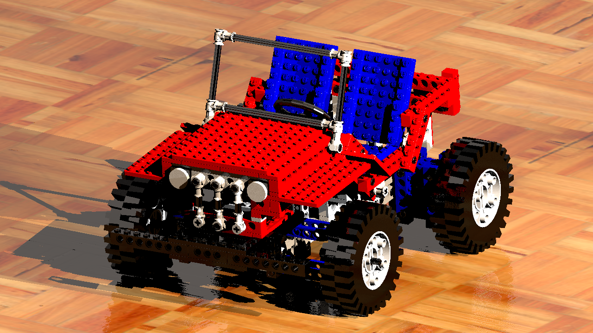

[LEGO© set 8865](http://www.technicopedia.com/8865.html), released in 1988, was the third generation auto chassis and improved upon the technology in the previous version, set 8860, in many ways.

© 1996 – 2025 **Jakob Flierl** - [koppi](https://github.com/koppi)
